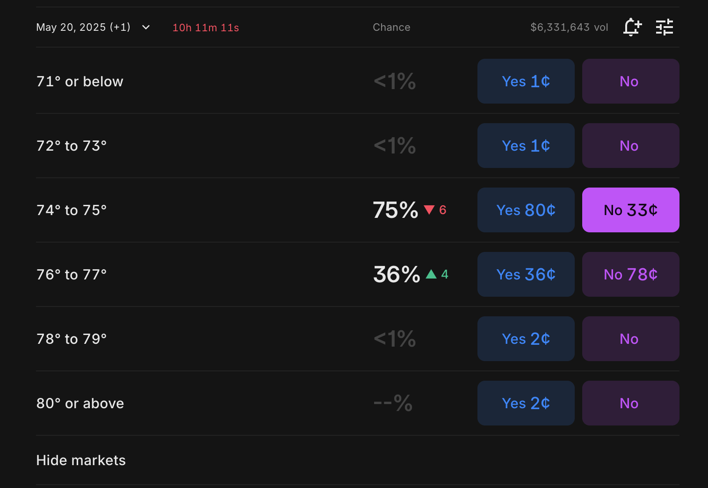
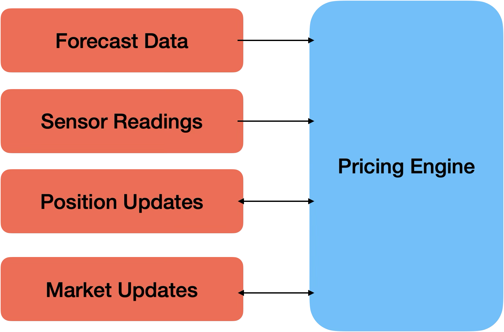

# Algorithmic Trading on Weather Betting Prediction Markets

This repository contains code used for trading on the event prediction exchange [Kalshi](https://kalshi.com/?category=all). Kalshi allows you to bet on the outcome of events rather than markets. I specifically trade on the daily high climate contracts.

A daily high climate contract lets you bet on the numerical value of the highest temperature reached in a city on a given day. As an example, the weather contracts for HIGHLAX-25MAY20 looks like:
.

The optimal price of each contract should be expected probability of the temperature strikes being the maximum that day. So if there is a temperature higher than the strike on the contract, the expected return on the contract is precisely 0.

## Data Collection
The best data sources that are used to evaluate the high each day is the climatological report by the NWS for each site. Each site is at an airport, which reports measurements every 5 minutes. Each NWS site also publishes forecast data every hour, but it is unknown how effective these forecast measurements actually are.

There is often rounding error with each measurement because the sensor rounds to the nearest celsius degree, causing variance of 2 degrees between measurements. It's unclear how much noise happens in these short term durations as well.

## In Progress
1. Pricing Algorithm
2. Websocket for Visual App

Having trouble finding how to integrate QWebSockets Asynchronously. I may not need to do it.

